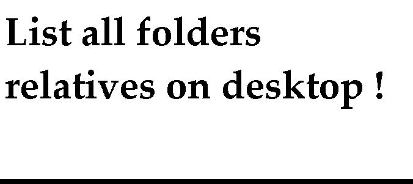



## ctlExplorer

### Description

Show files and folder into a listview/treeview into a unique control , counting with:

- Automatic strings of local machine (like my computer, panel control,

etc...)

- Support for all events relatives on file, folder and root

- Fast load with API and FileSystemObject

- Show true icons relatives on files and folders (folder like favorites, IE history and other have different icons).
 
### More Info
 

             |
---                |---
**Submitted On**   |2002-09-05 16:10:38
**By**             |[Mauricio Cunha](https://github.com/Planet-Source-Code/PSCIndex/blob/master/ByAuthor/mauricio-cunha.md)
**Level**          |Intermediate
**User Rating**    |4.4 (40 globes from 9 users)
**Compatibility**  |VB 5\.0, VB 6\.0, ASP \(Active Server Pages\) , VBA MS Access, VBA MS Excel
**Category**       |[Miscellaneous](https://github.com/Planet-Source-Code/PSCIndex/blob/master/ByCategory/miscellaneous__1-1.md)
**World**          |[Visual Basic](https://github.com/Planet-Source-Code/PSCIndex/blob/master/ByWorld/visual-basic.md)
**Archive File**   |[ctlExplore1314609152002\.zip](https://github.com/Planet-Source-Code/mauricio-cunha-ctlexplorer__1-39017/archive/master.zip)

